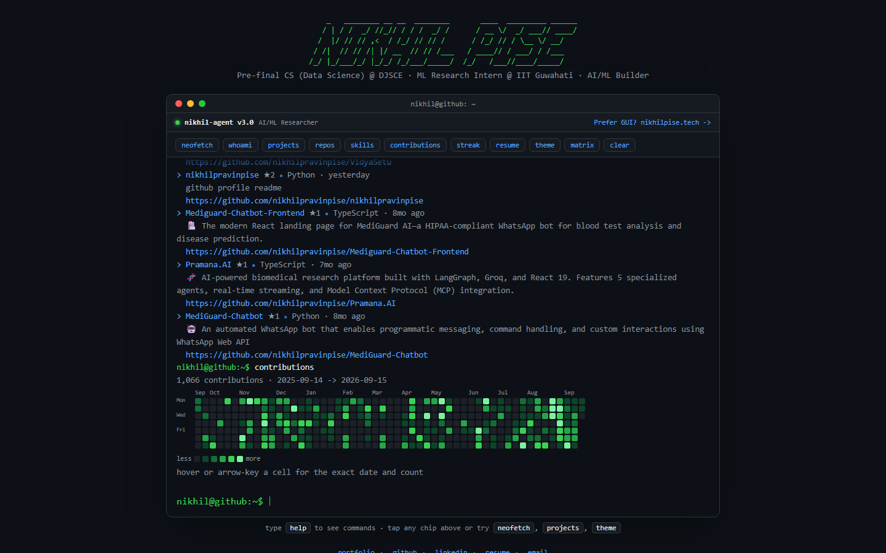

# nikhilpravinpise.github.io

[](https://github.com/nikhilpravinpise/nikhilpravinpise.github.io/actions/workflows/ci.yml)
[](https://github.com/nikhilpravinpise/nikhilpravinpise.github.io/actions/workflows/update-contributions.yml)

An interactive, terminal-styled GitHub profile, live at [nikhilpravinpise.github.io](https://nikhilpravinpise.github.io).

Type commands into a fake terminal to explore who I am. No framework, no build step - plain HTML, CSS and ES modules.



## Commands

| command | what it does |
| --- | --- |
| `help` | list available commands |
| `whoami` | who is this guy anyway (alias: `about`) |
| `neofetch` | system info, but for me |
| `experience` | work and research history |
| `skills` | technical stack and tools |
| `projects` | things I have shipped (alias: `ls`) |
| `repos` | top public repositories (live, updated daily) |
| `contributions` | live GitHub contribution heatmap with month labels |
| `streak` | current, longest, and active stats |
| `graph` | monthly contribution bar chart |
| `contact` | portfolio, linkedin, github, email |
| `resume` | open Google Drive resume in new tab |
| `open` | `open portfolio|resume|linkedin|github` |
| `copy` | `copy email|portfolio|resume|linkedin|github` to clipboard |
| `photo` | github avatar |
| `theme` | `theme dark|light|amber|synthwave` (persisted) |
| `matrix` | toggle matrix digital rain |
| `banner` | reprint ASCII banner art |
| `history` | list command history (`history -c` clears; persists across visits) |
| `clear` | clear the terminal (hotkey: Ctrl+L) |

Plus a few hidden ones for people who type `sudo`, `vim`, or `exit`.

**Terminal ergonomics:** `Tab` completes commands and sub-arguments, `Up`/`Down` walk history (with draft preservation), `Ctrl+L` clears, `Ctrl+C` abandons a line, `Ctrl+U` clears input. Deep links work too: `/#projects` or `/?cmd=streak` auto-runs a command on load.

## How it works

```
 GitHub GraphQL API            this repo                  the page
┌───────────────────┐   ┌──────────────────────┐   ┌────────────────────────┐
│ contributionCalendar│ │ scripts/             │   │ index.html + assets/*.js│
│ repositories        │─▶│  sync-github-data.js │──▶│ fetch data/*.json       │
└───────────────────┘   │  (daily cron)        │   │   │ on failure          │
                        │       │ writes       │   │   ▼                     │
                        │       ▼              │   │ assets/fallback.js      │
                        │  data/contributions  │   │ (generated snapshot)    │
                        │  data/repos.json     │   └────────────────────────┘
                        │  assets/fallback.js  │
                        └──────────────────────┘
```

- `index.html` is markup only; `assets/` holds the ES modules and CSS. No build step - what you see is what runs.
- The heatmap fetches `data/contributions.json`; if that fails it dynamic-imports the generated `assets/fallback.js` snapshot, and a service worker caches the last-seen data for true offline use.
- [`scripts/sync-github-data.js`](scripts/sync-github-data.js) queries `contributionsCollection` + top repositories, computes totals/streaks/monthly aggregates via the shared pure functions in [`assets/lib/stats.js`](assets/lib/stats.js), and rewrites the JSON + fallback snapshot.
- [`.github/workflows/update-contributions.yml`](.github/workflows/update-contributions.yml) runs it daily (and on demand), validates the output, and commits only if something changed.
- Heatmap intensity is bucketed by quantiles of the actual data (like GitHub), so every palette level is reachable.
- Contribution totals cover the last year as reported by GitHub's `contributionCalendar`; private-repo counts appear only if `CONTRIB_PAT` grants `read:user`.

## Local dev

```sh
npm install        # dev deps: jsdom + eslint + html-validate only
npm run dev        # zero-dep static server -> http://localhost:8000
```

(ES modules need a real server - opening `index.html` via `file://` won't work.)

## Testing and checks

```sh
npm test           # node:test suite: math, commands, input, heatmap,
                   # consistency, security, data validation (~100 tests)
npm run lint       # eslint
npm run validate   # checks data/*.json invariants + fallback parity
npm run check:links  # HEAD-checks every external URL and local file ref
npm run check      # lint + test + validate
```

CI runs all of the above plus `html-validate` on every push/PR, on Node 22 and 24.

## Regenerating data / artwork

```sh
CONTRIB_PAT=<token with read:user> npm run sync   # refresh data + fallback
npm run og                                        # rebuild OG image + icons
```

`npm run og` uses a headless Chrome/Edge binary already on the machine (override with `OG_BROWSER=/path/to/binary`). The OG image stats and heatmap strip come from `data/contributions.json`, so re-running keeps the social preview honest.

## Customizing it for yourself

Everything personal lives in [`assets/profile.js`](assets/profile.js) - bio, experience, skills, projects, links. Commands are defined once in [`assets/commands.js`](assets/commands.js); `help`, tab-completion and the table above are tested against that registry, so docs can't drift. Update `USERNAME` in `scripts/sync-github-data.js`, run `npm run sync && npm run og`, and it's yours.

## License

MIT - see [LICENSE](LICENSE).
